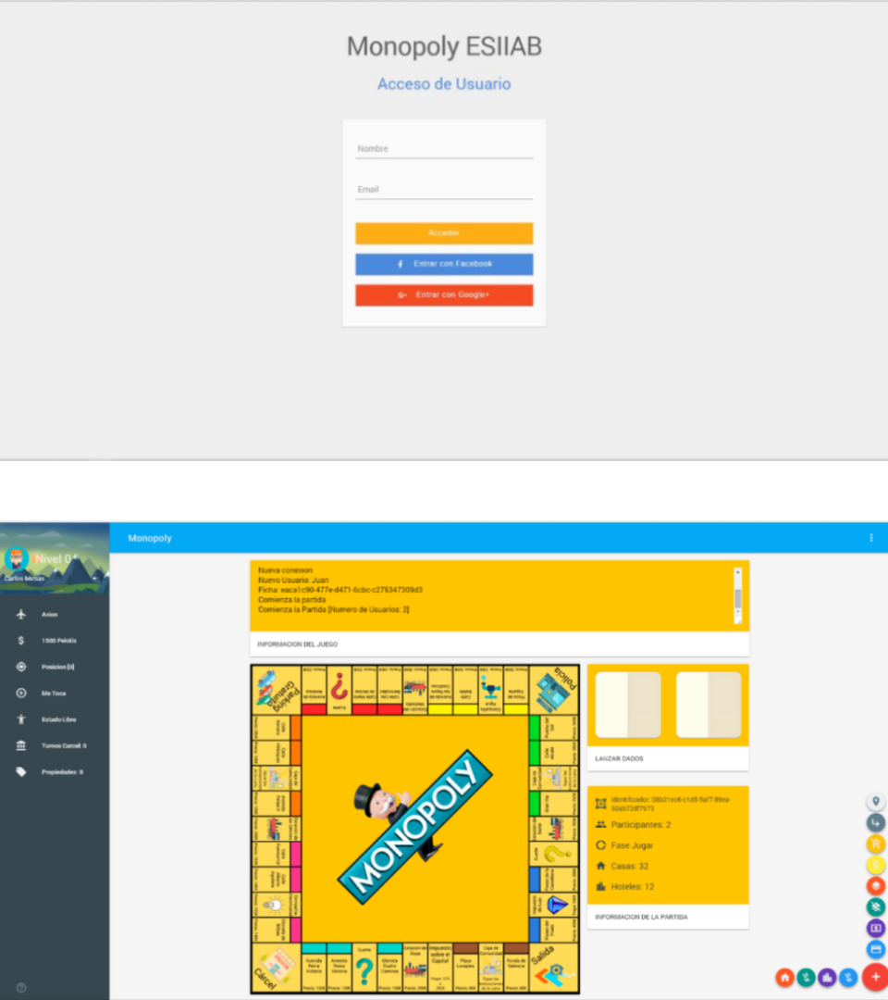
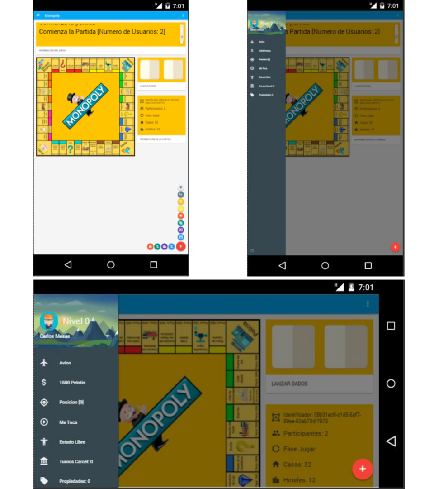

<!-- PROJECT LOGO -->
 

  

  <h3 align="center">Monopoly Game</h3>

  

    Monopoly web game with client + server to play in browser
     
  

<!-- ABOUT THE PROJECT -->
## About The Project

#### Desktop

#### Mobile

#### Description
Web game built in javascript as a personal initiative to learn about the use of javascript in conjunction with socket communication.

It includes unit tests on the implemented functionalities.

### Built With

Project dependencies

* [JQuery](https://jquery.com)
* [SocketIO](https://socket.io)

<!-- GETTING STARTED -->
## Getting Started

Read setup.txt

<!-- LICENSE -->
## License

Distributed under the MIT License.
